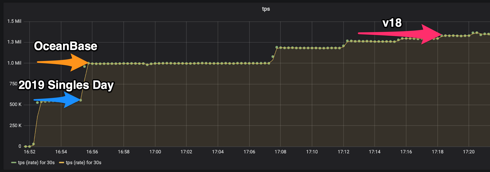

[](https://codecov.io/gh/eBay/Gringofts)

# Table of Contents
- [Introduction](#introduction)
- [Features](#features)
- [Get Started](#get-started)
- [Core Developers](#core-developers)
- [License Information](#license-information)
- [Use of 3rd Party Code](#use-of-3rd-party-code)

# Introduction

Gringofts makes it easy to build a replicated, fault-tolerant, high throughput and distributed event-sourced system. 
This type of system can process and store critical transaction data which is valuable for an entity.

Industries and typical applications that can benefit from Gringofts (but not limited to):
- Finance - Payment processing system
- Government - Civic Engagement system
- Healthcare - Electronic medical records (EMR) software
- Retail - Orders and sales management system
- Transport - Logistics and order management system
- ...

# Features

## Dependable Data
1. Data is highly available<br/>
Gringofts enables data to be stored in multiple replicas across data centers. 
Different deployment models are supported to achieve various levels of availability. 
For example, in a typical 2-2-1 setup (two replicas in each of the first two data centers and one replica in the third) 
data is still available even if two data centers are down.

1. Data is bit-level accurate across all replicas<br/>
Whichever replica you access, you get the exact same data. 
This is a top requirement for some applications such as a payment processing system, 
where each transaction must be accurately recorded.

1. Data is secure and tamper-proof<br/>
Industry-tested and accepted standards are used to encrypt the data 
and a blockchain-like technology is applied to avoid data being changed.

## High Throughput
Internal experiments show that a single cluster with a 2-1 setup (three replicas across two data centers) can process 8,000 transactions per second. 
Since the framework is designed to be linear-scalable, throughput can be increased with the increase of clusters. Below is a test result of a 667-cluster setup. 



## Full Audit-ability
This is another must-have feature in most critical enterprise systems. 
Every write operation to a Gringofts-powered application is persisted by default and is immutable. 
A comprehensive toolset is also available to access this type of information.

## Easy to Use
Gringofts users are usually domain experts. They only need to focus on two things which they are very good at and Gringofts will take care of the rest:
1. Domain model<br/>
This defines objects required to solve the target business problem. For example, in an Order Management system, Order is a domain object.
2. Domain object interaction</br>
This defines how domain objects interact with each other. 
The interaction is usually modeled as two special objects called Command and Event, 
for example PlaceOrderCommand and OrderPlacedEvent.

## 100% State Reproducibility
Application state at any point of time in history is reproducible. 
This feature is especially useful when an application recovers after a crash or if users want to debug an issue.

# Get Started

## Supported Platforms
Currently the only recommended platform is Ubuntu 16.04. We plan to support more platforms in the near future.

## Set up Source Dependencies
```bash
bash ./scripts/addSubmodules.sh
```

## Build
### Build via Docker (Recommended)
This approach requires minimum dependencies on the target OS as all of the dependencies are encapsulated in a docker image.
1. Build docker image for compiling the project (one-time setup)
   ```bash
   sudo docker build --rm -t gringofts/dependencies:v1 -f dockers/dependencies/download.Dockerfile .
   sudo docker build --rm -t gringofts/compile:v1 -f dockers/dependencies/install.Dockerfile .
   ```
1. Build binaries
   ```bash
   sudo docker run --workdir "$(pwd)" --mount type=bind,source="$(pwd)",target="$(pwd)" --user "$(id -u)":"$(id -g)" gringofts/compile:v1 hooks/pre-commit
   ```

### Build directly on local OS
1. Install external dependencies (one-time setup)
   ```bash
   sudo bash ./scripts/setupDevEnvironment.sh
   if ! grep 'export PATH=/usr/local/go/bin:$PATH' ~/.profile; then echo 'export PATH=/usr/local/go/bin:$PATH' >> ~/.profile; fi && \
   source ~/.profile
   ```
1. Build binaries
   ```bash
   hooks/pre-commit-build
   ```

## Run Demo App
1. Backed by a single-cluster setup
   ```bash
   examples/run_demo_backed_by_single_cluster.sh
   ```
1. Backed by a three-nodes-cluster setup
   ```bash
   examples/run_demo_backed_by_three_nodes_cluster.sh
   ```
1. Backed by SQLite3
   ```bash
   examples/run_demo_backed_by_sqlite.sh
   ```

## Development Environment Setup
Please refer to this [doc](docs/C++%20Development%20Environment.pdf) for details.

# Core Developers
- Bin (Glen) Geng <bigeng@ebay.com>
- Qi (Jacky) Jia <jqi1@ebay.com>

Please see [here](CONTRIBUTORS.md) for all contributors.

# Acknowledgements
Special thanks to [people](ACKNOWLEDGEMENTS.md) who give your support on this project.

# License Information
Copyright 2019-2020 eBay Inc.

Authors/Developers: Bin (Glen) Geng, Qi (Jacky) Jia

Licensed under the Apache License, Version 2.0 (the "License"); you may not use this file except in compliance with the License. You may obtain a copy of the License at

https://www.apache.org/licenses/LICENSE-2.0

Unless required by applicable law or agreed to in writing, software distributed under the License is distributed on an "AS IS" BASIS, WITHOUT WARRANTIES OR CONDITIONS OF ANY KIND, either express or implied. See the License for the specific language governing permissions and limitations under the License.

# Use of 3rd Party Code
Some parts of this software include 3rd party code licensed under open source licenses (in alphabetic order):

1. OpenSSL<br/>
   URL: https://www.openssl.org/<br/>
   License: https://www.openssl.org/source/license.html<br/>
   Originally licensed under the Apache 2.0 license.

1. RocksDB<br/>
   URL: https://github.com/facebook/rocksdb<br/>
   License: https://github.com/facebook/rocksdb/blob/master/LICENSE.Apache<br/>
   Apache 2.0 license selected.

1. SQLite<br/>
   https://www.sqlite.org/index.html<br/>
   License: https://www.sqlite.org/copyright.html<br/>
   SQLite Is Public Domain

1. abseil-cpp<br/>
   URL: https://github.com/abseil/abseil-cpp<br/>
   License: https://github.com/abseil/abseil-cpp/blob/master/LICENSE<br/>
   Originally licensed under the Apache 2.0 license.

1. cpplint<br/>
   URL: https://github.com/google/styleguide<br/>
   License: https://github.com/google/styleguide/blob/gh-pages/LICENSE<br/>
   Originally licensed under the Apache 2.0 license.

1. inih<br/>
   URL: https://github.com/benhoyt/inih<br/>
   License: https://github.com/benhoyt/inih/blob/master/LICENSE.txt
   Originally licensed under the New BSD license.

1. gRPC<br/>
   URL: https://github.com/grpc/grpc<br/>
   License: https://github.com/grpc/grpc/blob/master/LICENSE<br/>
   Originally licensed under the Apache 2.0 license.

1. googletest<br/>
   URL: https://github.com/google/googletest<br/>
   License: https://github.com/google/googletest/blob/master/LICENSE<br/>
   Originally licensed under the BSD 3-Clause "New" or "Revised" license.

1. prometheus-cpp<br/>
   URL: https://github.com/jupp0r/prometheus-cpp<br/>
   License: https://github.com/jupp0r/prometheus-cpp/blob/master/LICENSE
   Originally licensed under the MIT license.

1. spdlog<br/>
   URL: https://github.com/gabime/spdlog<br/>
   License: https://github.com/gabime/spdlog/blob/master/LICENSE<br/>
   Originally licensed under the MIT license.
